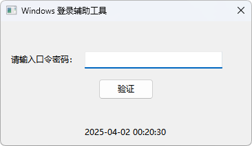
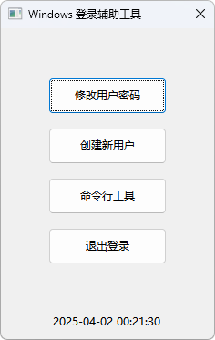
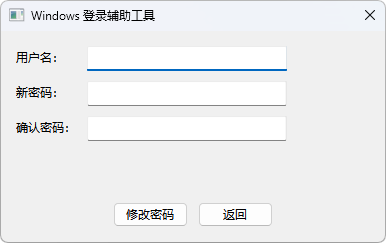
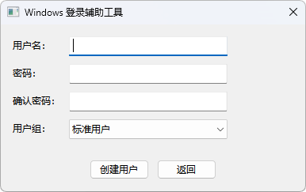

# <image src="Assets/icon-pic.png" height="32"/> Windows 登录辅助工具

### Windows-Login-Helper

#### 一款在 Windows 10/11 登录界面修改密码、创建用户、启动CMD命令行的小工具

 

 
口令认证界面

 

 
主界面

 

 
修改用户密码界面

 

 
创建用户界面

 

## 提醒

1. 若要提出 Bug 或新功能建议，请通过 [发起 Issue](https://github.com/WilsonHuangDev/Windows-Login-Helper/issues/new/choose) 使我知晓。当然，您也可以自行 [创建 Pull Request](https://github.com/WilsonHuangDev/Windows-Login-Helper/pulls) 修改。
2. 如有定制软件等特殊需求，请通过下方联系方式与我联系。

## 联系方式

邮箱: 2068364343@qq.com

bilibili 主页：[点击访问](https://space.bilibili.com/1056060818)

## 许可证

本项目基于 [GNU General Public License v3.0](LICENSE) 获得许可。
